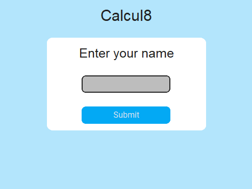
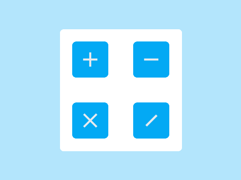
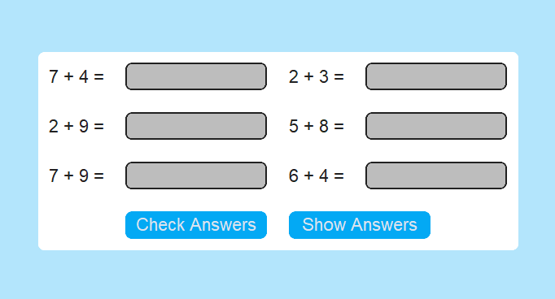

# Calcul8

Calcul8 is an interactive arithmetic practice application built using Python and customtkinter. It allows users to practice basic arithmetic operations (addition, subtraction, multiplication, and division) with varying levels of difficulty.

## Features

- **User Input**: Enter your name to personalize the experience.
- **Arithmetic Operations**: Choose from addition, subtraction, multiplication, and division.
- **Difficulty Levels**: Select the difficulty level (single-digit, double-digit, or triple-digit numbers).
- **Exercise Generation**: Automatically generates arithmetic exercises based on the selected operation and difficulty.
- **Answer Checking**: Validate your answers and get immediate feedback.
- **Show Answers**: Option to reveal the correct answers.
- **Navigation**: Easy navigation with back buttons.

## Installation

1. Clone the repository:
   ```sh
   git clone https://github.com/Flex223/calcul8.git
2. Navigate to the project directory:
   ```sh
   cd calcul8
3. Install the required dependencies:
   ```sh
   pip install customtkinter
## Usage

Run the application:
   ```sh
   pip install customtkinter
   ```
## Screenshots





